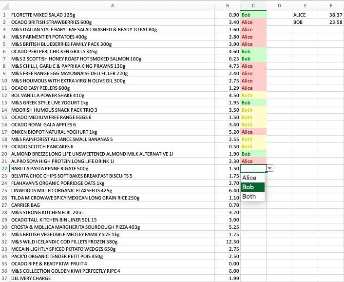

# Ocado project

Add an Ocado receipt in PDF format, run the code, and get an Excel file listing the grocery items in the receipt with
their corresponding cost. The Excel file also allows you to assign a person's name (from a drop-down list) to each item
and automatically calculate the total spend per person. You can also split the spending of a given item between several
people.

## How to run

- Add your PDF receipt to the root directory
  - The file name must have the following format: `receipt-04112024.pdf`
- Update the `date` variable at the top of `main.py` to match the date in the file name
  - For example `date = "04112024"`
- Update the `person1` and `person2` variables to the names of your choice
- Run `main.py`
- An Excel file is output to the root directory
  - The file name has format `receipt-04112024-19-39-26.xlsx`, which includes the date set above, as well as the time the script was run (to prevent overwriting)

## How to customise

- You can also easily extend this to more than 2 people
  - Adjust Excel formulas in the `# Add formulas` code block as well as the styling code blocks below
  - Replace all instances of `Both` to `All`

## How it works

- First it removes all unnecessary text from the receipt
  - This is done by using the RegEx patterns in `patterns_to_remove.py` and the strings in `strings_to_remove.py`
- Then it creates a list of 2-element lists, where the elements are a given item and its cost
- It also extracts the total charge from the receipt and ensures it is the same as the sum of the individual item costs
- Finally it creates an Excel file with some formulas, data validation, conditional colouring and styling
- This Excel file is saved to the root directory (an example is provided in the repo)
- There is also an `archives` folder to which old receipts and Excel files can be moved

## How to debug

- Errors are rare but may happen if Ocado changes the structure of their receipts or some of the text included in them
- As a safeguard there is an `assert` statement in `main.py` which ensures the sum of the costs in the Excel file is the same as the total charge in the receipt
- If this statement fails, `main.py` will break and you will need to debug it
- If the script does not break but the Excel does not look as expected, you will need to update the `patterns_to_remove.py` and `strings_to_remove.py` scripts accordingly